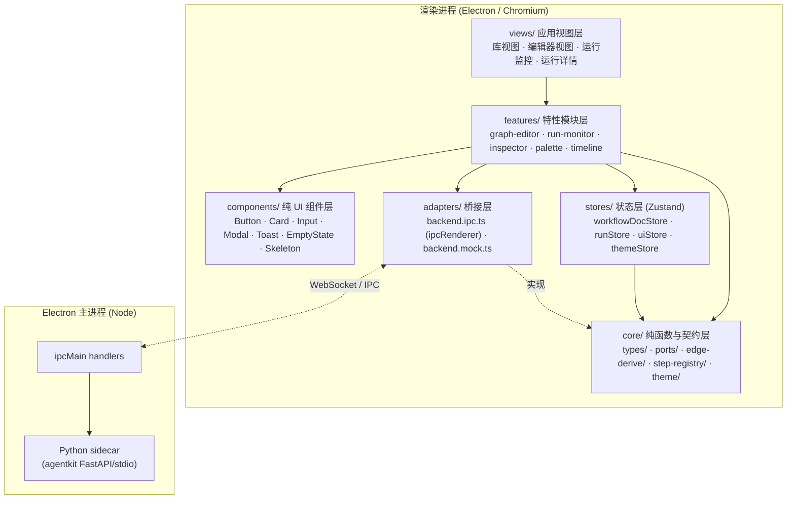
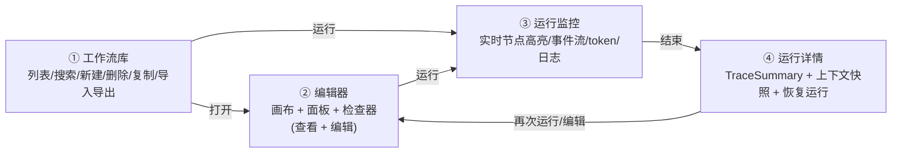
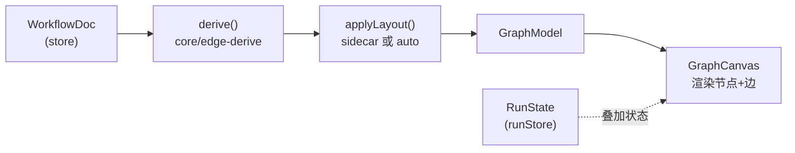

# AgentKit 可视化工作流 UI 设计规范

> 版本：v1.0 · 2026-07-21
> 范围：Electron 渲染进程（TypeScript）的**纯前端渲染层**设计。本层不实现任何业务逻辑，所有数据与命令通过 `BackendPort` 契约与后端（Python agentkit）交互。
> 设计基线：`design.md`（Estilo de Elegância Espacial）

---

## 0. 设计原则（不可妥协）

| 原则 | 落地方式 |
|------|----------|
| **渲染与逻辑分离** | 渲染进程只做三件事：状态持有（stores）、视图渲染（views/components）、副作用委托（adapters → BackendPort）。任何"推导/计算"都收敛到纯函数模块，可单测、可替换。 |
| **单一数据源** | 每个状态只有一个 store 负责，组件不直接持有业务状态，只订阅 store 的投影（selector）。 |
| **契约先行** | 后端能力全部抽象为 `BackendPort` 接口 + DTO 类型。UI 只依赖接口，不依赖实现（HTTP / IPC / Mock 可互换）。 |
| **不可变数据流** | 文档模型（WorkflowDoc）不可变；所有编辑通过 `EditorCommand` 产生 patch，再生成新文档，天然支撑撤销/重做。 |
| **无冗余** | 任何概念只定义一次：颜色 token 只定义一次（semantic tokens），Step 类型元数据只定义一次（StepRegistry），边推导只实现一次（EdgeDeriver）。 |
| **可配置** | 主题、断点、快捷键、面板布局、节点渲染器全部走注册表 / 配置表，不写死在组件里。 |

---

## 1. 总体架构

渲染进程采用**四层 + 一桥**结构：



**职责边界：**

- `core/`：**无依赖**的纯函数与类型。禁止 import React/Electron。所有"推导"发生在这里。
- `stores/`：只组合 core 的纯函数与 adapters 的副作用，不含 JSX。
- `components/`：无业务知识的原子组件，只吃 props。
- `features/`：业务组件，组合 components + stores，输出具体功能区块。
- `views/`：路由级页面，负责布局骨架与特性区块的拼装。
- `adapters/`：唯一允许触碰 `ipcRenderer` / WebSocket 的地方。

**依赖规则（单向，禁止回环）：** `views → features → {components, stores, core, adapters}`，`stores → {core, adapters}`，`core → ∅`。

---

## 2. 信息架构（四个视图）



| 视图 | 路由 | 核心区块 | 只读/可编辑 |
|------|------|----------|--------------|
| 工作流库 | `/library` | WorkflowList、SearchBar、ImportExport | 管理操作 |
| 编辑器 | `/edit/:workflowId` | GraphCanvas、StepPalette、Inspector、YamlPreview | 可编辑 |
| 运行监控 | `/run/:runId` | GraphCanvas(只读高亮)、EventStream、TokenMeter、LogPanel | 只读 + 取消 |
| 运行详情 | `/run/:runId/summary` | TraceTable、ContextInspector、ResumeButton | 只读 + 恢复 |

**编辑器布局（桌面 ≥1280px）：** 三栏 —— 左 `StepPalette`（可拖拽 Agent/Tool/Skill/Step 元数据）｜ 中 `GraphCanvas` ｜ 右 `Inspector`（选中节点的属性表单 + YAML 片段预览）。顶栏：工作流名、保存状态、撤销/重做、校验、运行按钮。

---

## 3. 核心 ViewModel 契约（`core/types/`）

UI 与后端之间只传这些 DTO。**所有时间用 ISO 字符串，所有 id 用 string。**

### 3.1 文档模型（编辑态）

```ts
// WorkflowDoc：编辑器持有的不可变文档，直接映射 YAML 结构
interface WorkflowDoc {
  name: string;
  inputs: string[];
  agents: AgentConfigDto[];
  providers?: ProviderDto[];
  skills?: SkillRefDto[];
  mcpServers?: McpServerDto[];
  steps: StepDto[];                    // 顶层线性步骤（与后端 YAML 一致）
}

// StepDto 与 agentkit YAML schema 一一对应，不做任何"图化"扭曲
interface StepDto {
  id: string;
  type: StepType;                      // 'llm'|'tool'|'skill'|'condition'|'loop'|'parallel'
  output?: string;
  retry?: RetryDto;
  timeout?: number;
  // 类型专属字段（condition.then/else、loop.step、parallel.branches 为嵌套 StepDto）
  [k: string]: unknown;
}
```

> **关键决策：文档模型保持"线性 + 嵌套容器"原貌**（与 agentkit 引擎一致），**不引入显式 edge 字段**。图的拓扑是渲染时的**投影**，而非存储格式。这样保证：YAML ⇄ UI 双向无损、未来后端若加 DAG 支持只需改投影不改存储。

### 3.2 图投影模型（渲染态，由 core 纯函数推导）

```ts
interface GraphNode {
  id: string;                          // step id（容器内用 path: "pl.branches[0]"）
  step: StepDto;
  kind: 'step' | 'container' | 'branch';
  depth: number;                       // 嵌套深度（parallel/condition/loop 的子步骤 depth+1）
  parentId?: string;
  layout?: NodeLayout;                 // 来自 sidecar，可选
}

interface GraphEdge {
  id: string;
  from: string;                        // 来源 node id
  to: string;                          // 目标 node id
  kind: 'sequence' | 'data';           // 顺序边 | 数据依赖边
  label?: string;                      // 数据边标注变量名，如 "{{orders_raw}}"
}

interface GraphModel { nodes: GraphNode[]; edges: GraphEdge[]; }
```

**边推导算法（`core/edge-derive/derive.ts`，纯函数）：**

1. **顺序边**：同一层级的相邻 step 之间连 `sequence` 边（`steps[i] → steps[i+1]`）；容器 step（condition/loop/parallel）的入口 → 第一个子步骤、子步骤序列、最后子步骤 → 容器出口，递归展开。
2. **数据边**：扫描每个 step 的所有字符串字段，用正则提取 `{{var}}` 引用；对每个引用变量 `v`，向上查找 `output === v` 的 step 作为来源，连 `data` 边（标注变量名）。查不到来源（来自 `inputs` 或环境变量 `${ENV}`）则跳过。
3. 输出 `GraphModel`，**不持久化**，每次文档变化时重新推导（O(n)，足够快）。

### 3.3 运行态模型

```ts
type RunStatus = 'running' | 'completed' | 'failed';        // 后端只有 3 态
type StepStatus = 'pending' | 'running' | 'success' | 'failed' | 'skipped';
// 注：pending 由前端推导 = 在 step 列表中但尚未收到 before_step 事件

interface RunEvent {                                       // 后端 LifecycleHooks 推送
  type: 'before_step'|'after_step'|'on_step_error'|'on_llm_call'|'on_tool_call'
      | 'before_workflow'|'after_workflow';
  runId: string;
  stepId?: string;
  ts: string;
  payload?: StepTraceDto | TokenUsageDto | ErrorDto;
}

interface RunState {
  runId: string;
  workflowName: string;
  status: RunStatus;
  stepStates: Record<string, StepNodeState>;               // stepId → 状态
  events: RunEvent[];                                      // 事件流水（用于时间线）
  tokenTotal: number;
  startedAt: string;
  error?: string;
}
```

---

## 4. 后端能力契约（`core/ports/BackendPort.ts`）

**这是 UI 的唯一依赖面。** Electron 主进程通过 IPC + Python sidecar 实现它；开发期用 `backend.mock.ts` 顶替。

```ts
interface BackendPort {
  // 工作流 CRUD（后端缺口①，需新增 WorkflowStore）
  listWorkflows(): Promise<WorkflowSummaryDto[]>;
  loadWorkflow(id: string): Promise<WorkflowDoc>;          // → load_workflow(path)
  saveWorkflow(doc: WorkflowDoc): Promise<{ id: string }>;
  deleteWorkflow(id: string): Promise<void>;
  validate(doc: WorkflowDoc): Promise<ValidationIssueDto[]>; // → validate_workflow

  // 元数据（左侧面板）
  listAgents(): Promise<AgentConfigDto[]>;                 // → list_agents()
  listTools(): Promise<ToolMetaDto[]>;                     // → ToolRegistry
  listSkills(): Promise<SkillMetaDto[]>;                   // → SkillRegistry

  // 运行（已具备，包装即可）
  run(id: string, inputs: Record<string, unknown>): Promise<{ runId: string }>;
  resume(runId: string): Promise<void>;                    // → Workflow.resume
  cancel(runId: string): Promise<void>;                    // 后端缺口②，需新增
  listRuns(workflowName?: string): Promise<RunSummaryDto[]>; // → LocalCheckpointStore.list_runs
  getRunDetail(runId: string): Promise<RunState>;          // → Checkpoint + traces

  // 实时事件流（自定义 LifecycleHooks → WebSocket/IPC push）
  subscribeRun(runId: string, cb: (e: RunEvent) => void): Unsubscribe;
}
```

**已知后端缺口（UI 按契约写，后端补齐）：**

| # | 缺口 | UI 侧对策 |
|---|------|-----------|
| ① | 无 Workflow CRUD 仓库 | `saveWorkflow` 暂落盘为 YAML 文件（`~/.agentkit/workflows/`） |
| ② | 无 cancel/pause | UI 提供 cancel 按钮但置灰并提示，待后端支持 |
| ③ | 无 LLM token streaming | UI 只做到 step 粒度更新，不做打字机 |
| ④ | 无节点坐标 | 见 §5 sidecar 布局策略 |
| ⑤ | 无显式 edge | UI 用 `edge-derive` 投影，不依赖后端 |

---

## 5. 布局持久化策略（sidecar，不污染 YAML）

节点坐标属于**视图状态**，不属于工作流定义。方案：

- **首选：自动布局**（`core/layout/elk.ts`，用 ELK 分层布局算法），开箱即用、永远整洁，**默认开启**。
- **可选：手动拖拽微调**，坐标存入 sidecar 文件 `<workflow>.layout.json`（与 YAML 同目录），格式：`{ [stepId]: { x, y } }`。
- 加载顺序：`GraphModel = derive(doc)` → `applyLayout(model, sidecar ?? autoLayout(model))`。
- 删除 step 时自动清理 sidecar 中孤儿坐标。YAML 文件本身**永不写入坐标**。

---

## 6. 主题系统（三层 token，design.md 落地）

### 6.1 三层架构

```
Layer 1  base tokens        原始色板（只在此定义一次，对应 design.md 调色板）
Layer 2  semantic tokens    语义角色（--color-bg-surface / --color-text-primary / --color-accent）
Layer 3  component tokens   组件级（--button-bg / --card-border），默认引用 semantic
```

组件**只允许使用 Layer 2/3**，禁止直接引用 Layer 1 或写死色值。

### 6.2 base tokens（`core/theme/tokens.base.css`）

```css
:root {
  /* 对应 design.md 调色板 */
  --c-charcoal: #1C1C1E;   /* Cinza Espacial */
  --c-silver:   #E0E0E0;   /* Prata */
  --c-white:    #FFFFFF;   /* Branco */
  --c-navy:     #000080;   /* Azul Meia-Noite (accent) */
  --c-starlight:#F0EAD6;   /* Luz Estelar */
  --c-rose:     #E8C3BA;   /* Areia Rosa */
  --c-deep:     #581845;   /* Roxo Profundo */
  --c-red:      #FF3B30;   /* Vermelho Produto (error) */

  /* 圆角 / 阴影 / 动效（直接来自 design.md） */
  --radius-sm: 12px; --radius-md: 24px; --radius-lg: 36px;
  --shadow-card: 0 2px 12px rgba(0,0,0,0.06);
  --shadow-hover: 0 2px 8px rgba(0,0,0,0.08);   /* design.md 上限 */
  --ease-out: cubic-bezier(0.22, 1, 0.36, 1);
  --dur-fast: 200ms; --dur-med: 300ms;
}
```

### 6.3 semantic tokens（light / dark 双主题）

```css
/* 浅色（默认） */
:root, [data-theme="light"] {
  --color-bg-page:      var(--c-white);
  --color-bg-surface:   var(--c-white);      /* 卡片 */
  --color-bg-muted:     #F6F6F7;
  --color-text-primary: var(--c-charcoal);
  --color-text-secondary: #5A5A5E;
  --color-border:       var(--c-silver);
  --color-accent:       var(--c-navy);       /* 链接/聚焦/主按钮 */
  --color-accent-fg:    var(--c-white);
  --color-error:        var(--c-red);
  --color-success:      #1E9E5A;             /* 饱和度 ≤80%，符合规范 */
  --color-warning:      #B8860B;
  --color-info:         var(--c-navy);
  /* 节点状态色（运行高亮） */
  --node-pending:  var(--c-silver);
  --node-running:  var(--c-navy);
  --node-success:  #1E9E5A;
  --node-failed:   var(--c-red);
  --node-skipped:  #9A9AA0;
  color-scheme: light;
}

/* 深色（design.md 标注支持 Full） */
[data-theme="dark"] {
  --color-bg-page:      var(--c-deep);       /* Roxo Profundo 作为主背景 */
  --color-bg-surface:   #2A2A2E;
  --color-bg-muted:     #222226;
  --color-text-primary: var(--c-silver);
  --color-text-secondary: #A9A9AF;
  --color-border:       #3D3D44;
  --color-accent:       #6E6EFF;             /* navy 在深底上提亮，饱和度受控 */
  --color-accent-fg:    var(--c-white);
  --color-error:        #FF6B61;
  --color-success:      #4ADE80;
  --color-warning:      #E3B341;
  --color-info:         #6E6EFF;
  --node-pending:  #4A4A52;
  --node-running:  #6E6EFF;
  --node-success:  #4ADE80;
  --node-failed:   #FF6B61;
  --node-skipped:  #6A6A72;
  --shadow-card: 0 2px 12px rgba(0,0,0,0.4);
  --shadow-hover: 0 2px 8px rgba(0,0,0,0.5);
  color-scheme: dark;
}
```

### 6.4 主题切换（`features/theme/ThemeProvider.tsx`）

- 状态机：`'light' | 'dark' | 'system'` 三选一，持久化到 `localStorage("agentkit.theme")`。
- `system` 时监听 `matchMedia('(prefers-color-scheme: dark)')`。
- 应用方式：只切换 `<html data-theme="...">`，**零 JS 重渲染**（全部走 CSS 变量）。
- `themeStore` 仅存用户选择，不存解析结果。

### 6.5 design.md 组件规范映射（节选）

| design.md 规范 | 实现 |
|----------------|------|
| Primary Button：12px 圆角、accent 填充、hover 8% 变暗 + 轻投影、active -1px 按压 | `components/Button` + `color-mix(in srgb, var(--color-accent) 92%, black)` |
| Card：12px 圆角、surface 底、`--shadow-card`、1px 边 | `components/Card` |
| Input：label 在上、1px 边、focus 2px accent 外扩环、error 文案在下 | `components/Input` |
| 禁用项：无纯黑 / 无装饰渐变 / 阴影不超上限 / 无 emoji 用图标 | Lint 规则 + 图标用 Lucide |
| 动效：仅 transform/opacity，200–300ms ease-out | 全局 motion token，禁用布局动画 |

---

## 7. 响应式策略

**断点（`core/theme/breakpoints.ts`，唯一来源）：**

```ts
export const BP = { sm: 640, md: 768, lg: 1024, xl: 1280 } as const;
// 容器最大宽 1280px 居中，左右 1.5rem padding（design.md）
```

**编辑器自适应：**

| 视口 | 布局 |
|------|------|
| ≥1024px | 三栏（Palette ｜ Canvas ｜ Inspector） |
| 768–1023px | 两栏：Canvas 全宽，Palette/Inspector 折叠为左右抽屉（图标触发） |
| <768px | 单栏：Canvas 为主，Palette 底部抽屉，Inspector 全屏 Modal；库视图卡片纵向堆叠 |

**实现手段：**
- 布局用 CSS Grid + 容器查询（`@container`）为主，媒体查询为辅，避免 JS 测量。
- 抽屉/Modal 的显隐由 `uiStore` 的 `panelState` 控制，断点变化通过 `matchMedia` listener 同步进 store。
- 画布（GraphCanvas）本身是无限平移/缩放区域，天然适配任意宽度。
- 遵守规范：无水平溢出、多栏在 768px 下全部塌缩、`min-h-[100dvh]` 而非 `h-screen`。

---

## 8. 编辑器核心机制

### 8.1 双向同步与撤销重做（patch-based）

```
用户操作 → EditorCommand → apply(doc): Patch → 新 doc（不可变）
                                            ↓
                              undoStack.push(inversePatch)
                              redoStack.clear()
```

- `EditorCommand`：`AddStep / RemoveStep / MoveStep / UpdateStepField / AddAgent / UpdateAgent / ...`，每种命令实现 `apply(doc): { patch, inversePatch }`。
- 撤销 = 应用 `inversePatch`，重做 = 应用 `patch`。栈容量上限 100。
- 命令全部定义在 `core/commands/`（纯函数），可单测；UI 只负责派发。

### 8.2 文档 → 图 → 渲染 流水线



- `GraphCanvas` 订阅 `workflowDocStore` 的 `GraphModel` 投影 + `runStore` 的 `stepStates`，把 `StepStatus` 映射为节点边框/光晕色（§6.3 `--node-*`）。
- 编辑态：节点可拖拽（写 sidecar）、可连线（**仅允许数据边意图**，实际生成 `output`/`{{var}}` 引用，不生成显式 edge）、点选打开 Inspector。
- 运行态：画布只读，节点按事件流实时变色，边按数据流向做流动动画（transform/opacity）。

### 8.3 表单驱动（Inspector）

- 每种 `StepType` 对应一个 `StepForm` 组件，注册在 `core/step-registry/`：
  `StepRegistry.register('llm', { form: LlmStepForm, icon: Bot, defaultStep: {...} })`。
- 新增 Step 类型 = 在 registry 注册一条，无需改任何既有组件（开闭原则）。
- 表单字段改动 → 派发 `UpdateStepField` 命令。右侧同步显示该 step 的 YAML 片段（只读预览，`yaml.dump(step)`）。

---

## 9. 运行监控机制

1. `runStore.start(runId)` → `BackendPort.subscribeRun(runId, dispatch)`。
2. 每个 `RunEvent` 进 `runStore.reduce(event)`（纯函数 reducer，可单测）：
   - `before_step(stepId)` → `stepStates[stepId] = 'running'`
   - `after_step(stepId, trace)` → `'success'`，记录 duration/token
   - `on_step_error` → `'failed'`，记录 error
   - `after_workflow(status)` → `runState.status = status`
3. `pending` 推导：渲染时 `stepStates[id] ?? 'pending'`（无需后端提供）。
4. 事件流同时追加到 `events[]`，驱动右侧时间线（TraceTimeline）与日志面板。
5. 组件卸载时调用 `Unsubscribe`，避免泄漏。

---

## 10. 目录规范（`src/`）

```
src/
├── main.ts                          # 入口：挂载 App、初始化 theme
├── core/                            # 纯函数 + 契约，无框架依赖
│   ├── types/                       # WorkflowDoc / GraphModel / RunState / DTO
│   ├── ports/BackendPort.ts         # 后端契约（§4）
│   ├── edge-derive/derive.ts        # 线性 steps → GraphModel（§3.2）
│   ├── layout/elk.ts                # 自动布局
│   ├── commands/                    # EditorCommand + undo/redo（§8.1）
│   ├── step-registry/               # Step 类型元数据注册表
│   └── theme/tokens.base.css        # Layer 1 tokens（§6.2）
├── adapters/
│   ├── backend.ipc.ts               # Electron ipcRenderer 实现
│   └── backend.mock.ts              # 开发/单测 Mock
├── stores/                          # Zustand stores（§1）
│   ├── workflowDocStore.ts
│   ├── runStore.ts
│   ├── uiStore.ts
│   └── themeStore.ts
├── components/                      # 原子 UI（Button/Card/Input/Modal/Toast/Skeleton/EmptyState）
├── features/
│   ├── graph-editor/                # GraphCanvas + GraphNode + GraphEdge + useGraphModel
│   ├── inspector/                   # Inspector + StepForms
│   ├── palette/                     # StepPalette（拖拽源）
│   ├── run-monitor/                 # EventStream + TokenMeter + TraceTimeline
│   ├── library/                     # WorkflowList + ImportExport
│   └── theme/ThemeProvider.tsx
├── views/                           # LibraryView / EditorView / RunView / RunDetailView
└── styles/
    ├── tokens.semantic.css          # Layer 2（§6.3，含 dark）
    ├── tokens.components.css        # Layer 3
    └── global.css                   # reset + 字体 + 动效 token
```

**命名与导入约束：**
- 跨目录引用用相对路径；`core` 内禁止出现 `react`/`electron` import（用 ESLint `no-restricted-imports` 强制）。
- 组件文件与样式同目录（`Button.tsx` + `Button.module.css`），样式只用 token 变量。

---

## 11. 可维护 / 可拓展 / 可配置 清单

| 维度 | 机制 |
|------|------|
| 新增 Step 类型 | `StepRegistry.register(...)` 一处注册，表单/图标/默认值/调色板项自动生效 |
| 新增主题 | 加一组 `[data-theme="x"]` semantic token，无需动组件 |
| 换后端通道 | 新增一个 `BackendPort` 实现（如 `backend.http.ts`），在 `main.ts` 注入即可 |
| 换布局算法 | `applyLayout` 接受策略参数，默认 elk，可换 dagre |
| 快捷键 | `core/keymap.ts` 配置表（`{ 'mod+z': undo, 'mod+shift+z': redo, 'mod+s': save }`），可覆盖 |
| 面板布局 | `uiStore.layout` 持久化各面板显隐/宽度，用户可自定义 |
| 文案 | 所有 UI 文案走 `core/i18n/zh.ts` 字典，组件不写字面量 |

---

## 12. 测试策略

| 层 | 测试 | 工具 |
|----|------|------|
| `core/` | 纯函数单测：边推导、命令 apply/inverse、reducer、token 推导 | Vitest |
| `stores/` | store + mock adapter 的行为测试 | Vitest |
| `components/` | 快照 + 交互（浅色/深色各一份快照） | Testing Library |
| 契约 | `backend.mock.ts` 与真实后端共用一组契约测试用例 | Vitest（golden fixtures） |
| 主题 | 双主题快照 + `color-scheme` 断言 | Testing Library |

---

## 13. 落地路线（里程碑）

| # | 里程碑 | 产出 | 依赖 |
|---|--------|------|------|
| M1 | 契约与骨架 | `core/types` + `BackendPort` + `backend.mock` + 目录骨架 + 主题 token 三件套 | — |
| M2 | 只读查看器 | Library 列表 + 加载 YAML + 自动布局渲染 GraphModel（只读） | M1 |
| M3 | 编辑器 | StepPalette 拖拽 + Inspector 表单 + 命令栈撤销重做 + 保存 | M2 |
| M4 | 运行监控 | run 触发 + 事件订阅 + 节点实时高亮 + 时间线 + token 表 | M3（后端 Hooks 桥接） |
| M5 | 运行详情与管理 | TraceSummary 表 + 上下文查看 + resume + 运行历史 | M4 |
| M6 | 打磨 | 响应式断点完善 + 深色主题走查 + 空态/骨架屏 + i18n | 全程 |

**M1 即可交付一个"能看"的版本，M3 交付"能编"，M4 交付"能跑"。**

---

## 14. 风险与对策

| 风险 | 对策 |
|------|------|
| 后端无线性→DAG 支持，强行连线会误导 | 数据边只作为"可视化投影"，编辑只允许改 `output`/引用，不承诺任意拓扑执行 |
| 深色主题对比度不达标 | semantic token 落地时跑一遍 WCAG AA 对比度校验脚本 |
| 大工作流（>200 节点）卡顿 | 画布用 Canvas/SVG 虚拟化渲染，节点视口外裁剪；边推导结果 memo |
| YAML 无损往返 | 文档模型与 YAML schema 1:1，未知字段原样保留（`[k: string]: unknown`），不丢字段 |
| 事件流断连 | `subscribeRun` 带重连 + 断连期间用 `getRunDetail` 轮询兜底 |
